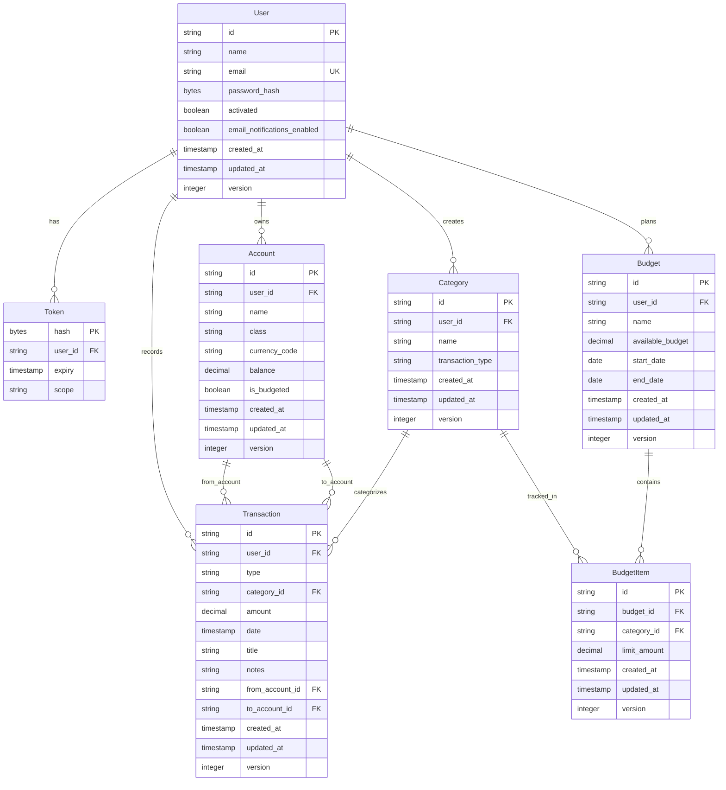

<div align="center">
  <br>
  <h1>NEMA API</h1>
  <p>Your financial clarity companion</p>
  <br>
</div>

## Table of Contents

- [Description](#description)
- [Live Demo](#live-demo)
- [Features](#features)
- [Database Design](#database-design)
- [Routes](#routes)
- [Tech Stack](#tech-stack)
- [Run Locally](#run-locally)
- [Contributing](#contributing)
- [License](#license)

## Description

[`^ back to top ^`](#table-of-contents)

**NEMA API** is the backend service for a personal finance management app that addresses the core problem of lack of spending awareness & incomplete financial picture that prevents individuals from achieving their financial goals. NEMA provides a simple system to track all financial transactions with minimal friction, monitor net worth across multiple accounts & asset classes, set monthly budget limits for expense categories, & get immediate visibility into spending patterns for informed financial decisions.

_This current version is the **Phase 1** implementation, focusing on core transaction tracking, account management, & budget monitoring capabilities._

## Live Demo

[`^ back to top ^`](#table-of-contents)

Check out the API here:

## Features

[`^ back to top ^`](#table-of-contents)

### Current Features

- **User Management**
  - Secure user registration with email/password
  - Email-based user account activation
  - User authentication

- **Account Management**
  - Add multiple financial accounts
  - Categorize accounts by class (Cash & Cash Equivalents, Investments, Liabilities)
  - Track current balances
  - Update & delete accounts

- **Transaction Tracking & Management**
  - Record income, expenses, & transfers
  - Automatic account balance updates
  - Filter by type, date range, category, & account
  - Search by transaction title
  - Sort by date & amount
  - Update & delete transactions

- **Category Management**
  - Default categories for income, expenses, & transfers
  - Organized by transaction type

- **Budget Management**
  - Set monthly budget limits per expense category
  - View current spending vs budget limits

- **Financial Overview**
  - Calculate total net worth (assets minus liabilities)

### Plan for Next Phase

- Enhanced budget management (update & remove limits)
- Detailed net worth breakdown by account class
- Monthly income & expense summaries
- Email notifications for budget check-ins

## Database Design

[`^ back to top ^`](#table-of-contents)

### Entities

- **User**: Represents a person using the app.
- **Token**: Represents tokens for user sessions & account activation.
- **Account**: Represents a financial account (e.g., bank account, investment, credit card) owned by a user. Categorized by account class (Cash & Cash Equivalents, Investment Assets, Liabilities).
- **Category**: Represents a transaction category (e.g., "Salary", "Groceries", "Transfer"). Can be system-default or user-defined, grouped by transaction type.
- **Transaction**: Represents a financial transaction (income, expense, or transfer) with amount, date, & associated accounts.
- **Budget**: Represents a monthly budget plan for a user with a specific time period.
- **Budget Item**: Represents spending limits for specific expense categories within a budget.

### Entity Relationship

Users manage their financial data through accounts, categories, transactions, & budgets.

```
User (1) ─── (N) Account
User (1) ─── (N) Category
User (1) ─── (N) Transaction
User (1) ─── (N) Budget
User (1) ─── (N) Token

Account (1) ─── (N) Transaction (as from_account)
Account (1) ─── (N) Transaction (as to_account)

Category (1) ─── (N) Transaction
Category (1) ─── (N) Budget Item

Budget (1) ─── (N) Budget Item
```

- `users` → `accounts`: **one-to-many**
  - A user can have zero or many accounts
  - Each account belongs to exactly one user

- `users` → `categories`: **one-to-many**
  - A user can have zero or many custom categories
  - Each custom category belongs to exactly one user

- `users` → `transactions`: **one-to-many**
  - A user can have zero or many transactions
  - Each transaction belongs to exactly one user

- `accounts` → `transactions`: **one-to-many**
  - An account can be the source for many expense/ transfer transactions
  - An account can be the destination for many income/ transfer transactions
  - Each transaction references one or two accounts depending on type

- `categories` → `transactions`: **one-to-many**
  - A category can be used in zero or many transactions
  - Each transaction belongs to exactly one category

- `users` → `budgets`: **one-to-many**
  - A user can have zero or many budgets
  - Each budget belongs to exactly one user

- `budgets` → `budget_items`: **one-to-many**
  - A budget can have zero or many budget items
  - Each budget item belongs to exactly one budget

- `categories` → `budget_items`: **one-to-many**
  - A category can be tracked in zero or many budget items
  - Each budget item tracks exactly one category

- `users` → `tokens`: **one-to-many**
  - A user can have zero or many tokens
  - Each token belongs to exactly one user

### Diagram



## Routes

[`^ back to top ^`](#table-of-contents)

| **Method** | **Pattern**                  | **Description**                |
| ---------- | ---------------------------- | ------------------------------ |
| POST       | /api/v1/users                | Register a user.               |
| PUT        | /api/v1/users/activated      | Activate a user.               |
| POST       | /api/v1/users/authentication | Authenticate a user.           |
| GET        | /api/v1/accounts             | Get user's financial accounts. |
| POST       | /api/v1/accounts             | Add a financial account.       |
| PATCH      | /api/v1/accounts/{id}        | Update a financial account.    |
| DELETE     | /api/v1/accounts/{id}        | Delete a financial account.    |
| GET        | /api/v1/categories           | Get transaction categories.    |
| GET        | /api/v1/transactions         | Get user's transactions.       |
| POST       | /api/v1/transactions         | Add a transaction.             |
| GET        | /api/v1/transactions/{id}    | Get transaction details.       |
| PATCH      | /api/v1/transactions/{id}    | Update a transaction.          |
| DELETE     | /api/v1/transactions/{id}    | Delete a transaction.          |
| POST       | /api/v1/budgets              | Create a new budget.           |
| GET        | /api/v1/budgets/{id}         | Get budget details.            |
| POST       | /api/v1/budgets/{id}/items   | Create a new budget item.      |
| GET        | /api/v1/net-worth            | Get net worth.                 |

## Tech Stack

[`^ back to top ^`](#table-of-contents)

- Language: [Go 1.24](https://go.dev)
- DBMS: [PostgreSQL](https://www.postgresql.org)
- Database Driver: [pq](https://github.com/lib/pq)
- Database Migration: [migrate](https://github.com/golang-migrate/migrate)

## Run Locally

[`^ back to top ^`](#table-of-contents)

### Development

- Make sure you have [Go 1.24](https://go.dev), [PostgreSQL](https://www.postgresql.org), [migrate](https://github.com/golang-migrate/migrate), & [Make](https://www.gnu.org/software/make) installed on your computer. Run these commands to check whether the tools are already installed. The terminal will output the version number if it is installed.

  ```bash
  go version
  ```

  ```bash
  psql --version
  ```

  ```bash
  migrate -version
  ```

  ```bash
  make --version
  ```

- Connect to the PostgreSQL server by providing a user name & password.

  ```bash
  psql -U postgres
  ```

  Then create a database. You can name it as `nema`.

  ```sql
  CREATE DATABASE nema;
  ```

- Clone the repo.

  ```bash
  git clone https://github.com/nadianeyl/nema-api.git
  ```

  ```bash
  cd nema-api
  ```

- Create a new `NEMA_DB_DSN` by adding the following line to `$HOME/.profile` or `$HOME/.bashrc`.

  ```bash
  export NEMA_DB_DSN='postgres://<username>:<password>@localhost/nema?sslmode=disable'
  ```

- Run `source` command on the file that you’ve just edited to effect the change.

  ```bash
  source $HOME/.profile
  ```

- Install the dependencies.

  ```bash
  go mod tidy
  ```

- Apply migrations.

  ```bash
  make db/migrations/up
  ```

- Run the server. The server will run on port 4000.

  ```bash
  make run/api
  ```

### Format & Check the Code

Run this command to tidy the dependencies, format the code, & vet the code.

```bash
make audit
```

## Contributing

[`^ back to top ^`](#table-of-contents)

Contributions are welcome! You can contribute to this project by creating [pull request](https://github.com/nadianeyl/nema-api/pulls).

If you encounter any issues or have questions, please file an [issue](https://github.com/nadianeyl/nema-api/issues).

## License

[`^ back to top ^`](#table-of-contents)

This project is licensed under the AGPL v3.0 License - see the [LICENSE](https://github.com/nadianeyl/nema-api/blob/main/LICENSE) file for details.
